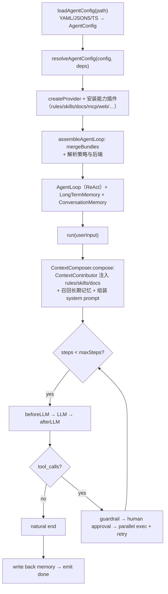

# Agent Engine

> **Configuration as Agent** — a universal, configurable **Agent kernel execution engine (harness)**.

Agent Engine is a TypeScript harness that runs the **full Agent lifecycle** — assembly, the ReAct loop, memory, retrieval, safety — so you build a vertical-domain Agent by **writing config only, with zero kernel changes**.

```text
配置即 Agent：写一份 YAML，得到一个能跑、有记忆、会检索、受约束、可拦截的 Agent。
```

## What problem it solves

| Problem                                                   | How Agent Engine solves it                                                                            |
| --------------------------------------------------------- | ----------------------------------------------------------------------------------------------------- |
| Every domain Agent reimplements the loop / memory / tools | One self-built kernel (`AgentLoop` + assemble + hooks + rules) reused across domains                  |
| Capability explosion → huge prompt & distracted LLM       | Unified `hybridRetrieve` (BM25 + vector RRF) recalls only the top-k relevant rules/skills/documents   |
| Long conversations overflow the window                    | Three-tier memory: token-budget compaction → rolling summary → semantic recall                        |
| Untrusted model runs arbitrary commands                   | Four-layer defense: config allowlist → guardrail → docker/nsjail sandbox → limits & audit             |
| Large document corpora                                    | `documents` axis: normalize → Markdown → chunk → retrieve → inject `[文档]`                           |
| Vendor lock-in (LangChain etc.)                           | Self-built kernel + official SDKs only (`openai` / `@anthropic-ai/sdk` / `@modelcontextprotocol/sdk`) |

## Quick Start

### 1. Install

```bash
pnpm add @lhx-agent-engine/config @lhx-agent-engine/core
```

> The kernel is ESM, Node.js ≥ 20. The example below runs TypeScript directly with [`tsx`](https://tsx.is).

### 2. Write a config — `agent.yaml`

```yaml
name: hello-agent
model:
  provider: openai-compatible # default DeepSeek (OpenAI-compatible); anthropic / custom also supported
  baseURL: https://api.deepseek.com/v1
  model: deepseek-chat
systemPrompt:
  template: 你是一个简洁、可靠的助手。
```

### 3. Run it — `run.ts`

```ts
import { loadAgentConfig } from '@lhx-agent-engine/config';
import { createProvider, resolveAgentConfig } from '@lhx-agent-engine/core';

// 1) load YAML/JSON5/TS → AgentConfig (Zod-validated, deep-frozen)
const config = await loadAgentConfig('agent.yaml');

// 2) assemble config → a runnable Agent
const resolved = await resolveAgentConfig(config, {
  // the kernel only reads `model.apiKey`; inject it from the environment here
  providerFactory: (model) =>
    createProvider({ ...model, apiKey: model.apiKey ?? process.env.DEEPSEEK_API_KEY }),
});

// 3) run one turn (multi-turn: call run() again on the same `resolved.agent`)
const result = await resolved.agent.run('用一句话介绍你自己');
console.log(result.finalMessage.content);

// 4) release resources (MCP connections, etc.)
await resolved.dispose();
```

```bash
DEEPSEEK_API_KEY=sk-... npx tsx run.ts
```

That's it — one YAML + three lines of code produce a working Agent. Every vertical-domain Agent is just a different config file.

## Configuration as Agent

The 8 core axes plus the model/runtime axes — all declarative, all Zod-validated from one `AgentConfig` schema:

| Group               | Axis           | What it configures                                                        |
| ------------------- | -------------- | ------------------------------------------------------------------------- |
| 能力 (capabilities) | `tools`        | disable any builtin / plugin / MCP tool (`tools.disabled`)                |
|                     | `skills`       | reusable skill packs (`path` / `npm` / `git`) loaded on demand            |
|                     | `mcp`          | external MCP servers normalized into standard tools                       |
| 扩展 (extension)    | `plugins`      | bundle tools + skills + hooks + rules + backends (files / bash / git / …) |
| 控制 (control)      | `hooks`        | lifecycle interception (observe / rewrite, never block)                   |
|                     | `rules`        | context rules: `always` injected or `on-demand` retrieved                 |
|                     | `guardrails`   | executable safety blocks (deny tools / deny patterns)                     |
| 上下文 (context)    | `systemPrompt` | template + variables (rules/skills/docs inject via `ContextContributor`)  |
|                     | `memory`       | session window (compaction + summary) + long-term memory                  |
|                     | `documents`    | ingest docs (md/html/pdf/docx/epub) → chunk → retrieve → inject           |
| 模型 (model)        | `model`        | chat LLM + fallbacks (failover) + routes (routing)                        |
|                     | `embedding`    | vector model → semantic recall (memory + rules/skills + docs)             |
| 运行 (runtime)      | `execution`    | max steps / tool calls / timeout / retry / continuation                   |
|                     | `security`     | sandbox + bash/file/web policies                                          |
|                     | `cache`        | cache backend (in-memory default, redis pluggable)                        |

## Model composition

One agent can combine multiple models across three layers — capability slots, routing, and failover:

| Layer      | Field                 | Role                                                     |
| ---------- | --------------------- | -------------------------------------------------------- |
| capability | `model` / `embedding` | different protocols → top-level fields (chat vs vectors) |
| routing    | `model.routes`        | same protocol → switch by complexity / capability tag    |
| failover   | `model.fallbacks`     | fall back in order after the primary exhausts retries    |

```yaml
model:
  model: deepseek-chat # default execution model (fast / cheap)
  fallbacks: # failover: switch when the primary fails
    - model: glm-4-plus
      baseURL: https://open.bigmodel.cn/api/paas/v4
      apiKey: ${GLM_API_KEY}
  routes: # routing: auto-switch to a reasoning model for complex tasks
    - name: reasoning
      model: deepseek-reasoner
      when:
        minInputTokens: 8000
    - name: vision # capability routing: switch to a VLM when vision is requested
      model: qwen-vl-max
      when:
        capabilities: [vision]
embedding: # vector model (separate capability slot)
  provider: openai-compatible
  baseURL: https://api.openai.com/v1
  model: text-embedding-3-small
```

Rules of thumb:

- **Split into slots only when the protocol differs** — `model` (chat) and `embedding` (vectors) have different interfaces; keep them as top-level fields.
- **Route, do not slot, when only depth / cost differs** — `thinkLM` (`deepseek-reasoner`) and `LLM` (`deepseek-chat`) are both chat; switch via `routes` by complexity instead of adding a field.
- **VLM (vision) is a capability slot** — it carries image input; extend a `vision` field later, or route via `routes.when.capabilities: [vision]` for now.

## A complete example

```yaml
name: devops-agent
description: 云原生与 CI/CD 领域的 DevOps 助手
version: 1.0.0

model:
  provider: openai-compatible
  baseURL: https://api.deepseek.com/v1
  model: deepseek-chat
  temperature: 0.2
  # 采样参数（均可选，缺省走模型默认；anthropic 仅支持 topP / stop）
  topP: 0.9 # 核采样（0~1）
  frequencyPenalty: 0.0 # 高频 token 惩罚（-2~2）
  presencePenalty: 0.0 # 已出现 token 惩罚（-2~2）
  stop: [] # 停止序列数组
  seed: 42 # 随机种子（可复现）
  # 进阶（均可选）：toolChoice（auto/none/required/指定函数）、parallelToolCalls、extra（vendor 透传兜底）

# rules / skills / documents 经能力插件（ContextContributor）自动注入，无需 {{rules}} 占位符
systemPrompt:
  template: |
    你是 {{role}}，专注于 {{domain}} 领域。
  variables:
    role: DevOps 运维专家
    domain: 云原生与 CI/CD

# 上下文规则：always 强制注入 / on-demand 按查询语义检索注入
rules:
  - id: no-destructive-command
    kind: always
    description: 禁止执行破坏性命令
    content: 禁止执行 rm -rf、DROP TABLE、DROP DATABASE 等破坏性命令。
    tags: [安全]
  - id: k8s-diagnosis
    kind: on-demand
    description: Kubernetes 故障诊断规范
    content: 排查顺序：kubectl get events → describe pod → logs。
    tags: [k8s, kubernetes, 诊断]

# 能力插件（rules/skills/documents/memory/web/mcp/guardrails）由 @lhx-agent-engine/preset-default
# 按配置切片自动激活；文件 / 命令 / git 仍按需在 plugins 声明（server 层注入工厂）
plugins:
  - '@lhx-agent-engine/plugin-files'
  - '@lhx-agent-engine/plugin-bash'

# 外部 MCP server → 归一化为标准工具
mcp:
  servers:
    - name: github
      source: command
      command: npx
      args: ['-y', '@modelcontextprotocol/server-github']
      env:
        GITHUB_TOKEN: <your-token>

skills:
  - source: path
    path: ./skills/incident-response

# 三层记忆：会话窗口（裁剪 + 摘要）+ 长期记忆（语义召回 + 持久化）
memory:
  session:
    maxMessages: 50
    maxTokens: 8000
    summary: true
  longTerm:
    backend: in-memory # 生产可换 pgvector（经插件注册）

# 向量模型（可选）：配置后 memory / rules / skills / documents 全部启用语义召回（BM25 + 向量 RRF）
# 需要一个真实的向量模型端点（DeepSeek 不提供 embeddings；可用 OpenAI / 本地 ollama 等）
embedding:
  provider: openai-compatible
  baseURL: https://api.openai.com/v1
  model: text-embedding-3-small

# 文档摄入：归一化 → 分块 → 检索注入 [文档]
documents:
  sources: ['./knowledge'] # 文件或目录（目录递归）
  chunking:
    strategy: heading # heading | fixed
    size: 1000
    overlap: 0
  topK: 4

# 声明式安全拦截（可执行，独立于文本类 rules）
guardrails:
  - id: deny-rm
    on: beforeToolCall
    denyTools: [bash]
    denyPatterns: ['rm -rf']

# 执行预算 / 重试 / 续写
execution:
  maxSteps: 10
  maxToolCalls: 30
  timeoutMs: 120000
  toolRetry:
    maxRetries: 2
    baseDelayMs: 500

# 安全默认：bash 默认禁用；开启后经 docker/nsjail 沙箱执行，绝不回退宿主裸奔
security:
  bash:
    enabled: true
    allowCommands: [kubectl, git, ls, cat]
    denyPatterns: ['rm -rf', 'DROP TABLE']
    allowNetwork: true
  files:
    roots: [/workspace]
  webSearch:
    provider: duckduckgo # searxng | duckduckgo | tavily | serper
```

## How a run works



Every node on the loop (`beforeLLM`, `afterLLM`, `beforeToolCall`, `afterToolCall`, `onStepEnd`, …) is a **hook** you can observe or rewrite; **guardrails** are the only things allowed to block.

## Architecture & packages

```text
                ┌── cli
config ← core ←┼── server ──(HTTP API)──▶ apps/web (React 19 + Rsbuild)
                └── plugins

docs/ (Rspress) is a standalone site
```

| Package                               | Description                                                                                                        | Status         |
| ------------------------------------- | ------------------------------------------------------------------------------------------------------------------ | -------------- |
| `@lhx-agent-engine/config`            | Config schema + three-format loader (`loadAgentConfig`)                                                            | ✅ implemented |
| `@lhx-agent-engine/core`              | Kernel: engine (AgentLoop / assemble / hooks / backends) + protocols (retrieval / ToolSource / ContextContributor) | ✅ implemented |
| `@lhx-agent-engine/server`            | HTTP server (REST + streaming) with env-key provider factory + preset-default                                      | ✅ implemented |
| `@lhx-agent-engine/preset-default`    | Aggregates all capability plugins + config-slice activation + long-term memory factory                             | ✅ implemented |
| `@lhx-agent-engine/plugin-rules`      | context rules: `always` inject + on-demand `hybridRetrieve`                                                        | ✅ implemented |
| `@lhx-agent-engine/plugin-skills`     | skill packs (path/npm/git): load + retrieve + bundle tools                                                         | ✅ implemented |
| `@lhx-agent-engine/plugin-documents`  | document ingestion (md/html/pdf/docx/epub) → chunk → `hybridRetrieve`                                              | ✅ implemented |
| `@lhx-agent-engine/plugin-memory`     | semantic long-term memory (`SemanticMemory`)                                                                       | ✅ implemented |
| `@lhx-agent-engine/plugin-pgvector`   | pgvector vector store + long-term memory KV persistence                                                            | ✅ implemented |
| `@lhx-agent-engine/plugin-redis`      | Redis cache backend (TTL KV)                                                                                       | ✅ implemented |
| `@lhx-agent-engine/plugin-web`        | `web_search` / `web_fetch` (multi search provider)                                                                 | ✅ implemented |
| `@lhx-agent-engine/plugin-mcp`        | MCP client (stdio) → normalized tools                                                                              | ✅ implemented |
| `@lhx-agent-engine/plugin-guardrails` | compile declarative `guardrails` config → executable rules                                                         | ✅ implemented |
| `@lhx-agent-engine/plugin-files`      | `read_file` / `write_file` / `list_files`                                                                          | ✅ implemented |
| `@lhx-agent-engine/plugin-bash`       | sandboxed `bash`                                                                                                   | ✅ implemented |
| `@lhx-agent-engine/plugin-git`        | git tool suite (read-only default, sandboxed)                                                                      | ✅ implemented |
| `@lhx-agent-engine/plugin-otel`       | OpenTelemetry observability                                                                                        | ✅ implemented |
| `@lhx-agent-engine/cli`               | CLI entry                                                                                                          | 📦 scaffold    |
| `@lhx-agent-engine/web`               | Integrated platform (`apps/web`)                                                                                   | 🚧 partial     |

## Development

```bash
pnpm install            # install dependencies
pnpm build              # build all packages (tsdown + Turborepo)
pnpm test               # Rstest tests
pnpm typecheck          # tsc --noEmit (all packages)
pnpm lint               # Rslint
pnpm format             # Prettier
pnpm spell              # cspell
pnpm lint:md            # markdownlint
```

## Milestones

1. **M1 Kernel skeleton** ✅ — monorepo + config (schema/loader) + core (LLM / tools / Agent Loop).
2. **M2 Configurable capabilities** ✅ — hooks / rules / skills / plugins + system-prompt assembly + memory + built-in tools + sandbox.
3. **M3 Extensions** 🚧 — MCP ✅, resolve ✅, streaming ✅, session lifecycle ✅, loop hardening ✅, reasoning transparency ✅, three-tier memory ✅, FunctionSandbox (WASI) ✅, guardrails ✅, semantic recall (RRF) ✅. Remaining: multi-agent orchestration.
4. **M4 Services** 🚧 — HTTP server ✅. Remaining: CLI.
5. **M5 Platform & docs** 🚧 — `apps/web` ✅. Remaining: docs site, Docker, example agents.

## Docs

- [`AGENTS.md`](./AGENTS.md) — authoritative project doc (architecture, conventions); read before developing.
- [`packages/core/README.md`](./packages/core/README.md) — kernel subpath exports & design notes.
- [`openspec/`](./openspec) — spec-driven development (specs / changes).
- [`docs/`](./docs) — Rspress docs site (scaffold).

## License

TBD.
