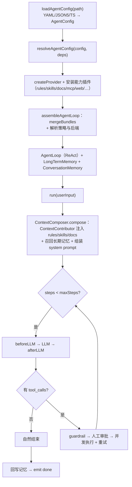

# Agent Engine

> **配置即 Agent（Configuration as Agent）** —— 一个通用、可配置化的 **Agent 内核执行引擎（harness）**。

Agent Engine 是一个 TypeScript 内核，跑通 Agent 的**完整生命周期**——装配、ReAct 循环、记忆、检索、安全拦截——让你**只写配置、不改内核**，就能搭出一个垂直领域 Agent。

```text
写一份 YAML，得到一个能跑、有记忆、会检索、受约束、可拦截的 Agent。
```

## 解决什么问题

| 痛点                                        | Agent Engine 怎么解                                                                      |
| ------------------------------------------- | ---------------------------------------------------------------------------------------- |
| 每个领域 Agent 都重写一遍循环 / 记忆 / 工具 | 一套自研内核（`AgentLoop` + 装配 + hooks + rules）跨领域复用                             |
| 能力太多 → prompt 爆炸 + 模型注意力分散     | 统一 `hybridRetrieve`（BM25 + 向量 RRF）检索，只召回 top-k 相关的 rules/skills/documents |
| 长对话撑爆上下文窗口                        | 三层记忆：token 预算裁剪 → 滚动摘要 → 语义召回                                           |
| 不可信模型乱跑命令                          | 四层防御：配置 allowlist → guardrail → docker/nsjail 沙箱 → 限额 & 审计                  |
| 大量文档要喂给 Agent                        | `documents` 轴：归一化 → Markdown → 分块 → 检索 → 注入 `[文档]`                          |
| 被 LangChain 等框架绑架                     | 内核自研 + 只用官方 SDK（`openai` / `@anthropic-ai/sdk` / `@modelcontextprotocol/sdk`）  |

## 快速开始

### 1. 安装

```bash
pnpm add @agent-engine/config @agent-engine/core
```

> 内核为 ESM，Node.js ≥ 20。下面的例子用 [`tsx`](https://tsx.is) 直接跑 TypeScript。

### 2. 写一份配置 —— `agent.yaml`

```yaml
name: hello-agent
model:
  provider: openai-compatible # 默认 DeepSeek（OpenAI 兼容）；也支持 anthropic / custom
  baseURL: https://api.deepseek.com/v1
  model: deepseek-chat
systemPrompt:
  template: 你是一个简洁、可靠的助手。
```

### 3. 跑起来 —— `run.ts`

```ts
import { loadAgentConfig } from '@agent-engine/config';
import { createProvider, resolveAgentConfig } from '@agent-engine/core';

// 1) 加载 YAML/JSON5/TS → AgentConfig（Zod 校验 + 深度冻结）
const config = await loadAgentConfig('agent.yaml');

// 2) 装配：配置 → 可运行的 Agent
const resolved = await resolveAgentConfig(config, {
  // 内核只读 `model.apiKey`；这里从环境变量注入
  providerFactory: (model) =>
    createProvider({ ...model, apiKey: model.apiKey ?? process.env.DEEPSEEK_API_KEY }),
});

// 3) 跑一轮（多轮：对同一个 `resolved.agent` 再调 run() 即可）
const result = await resolved.agent.run('用一句话介绍你自己');
console.log(result.finalMessage.content);

// 4) 释放资源（MCP 连接等）
await resolved.dispose();
```

```bash
DEEPSEEK_API_KEY=sk-... npx tsx run.ts
```

就这样——一份 YAML + 三行代码，就是一个能跑的 Agent。每个垂直领域 Agent，本质只是换一份配置。

## 配置即 Agent

八大核心轴 + 模型/运行轴，全部声明式、由同一份 `AgentConfig` Schema（Zod）校验：

| 分组   | 配置轴         | 配置什么                                                                |
| ------ | -------------- | ----------------------------------------------------------------------- |
| 能力   | `tools`        | 禁用任意 builtin / plugin / MCP 工具（`tools.disabled`）                |
|        | `skills`       | 可复用技能包（`path` / `npm` / `git`），按需加载                        |
|        | `mcp`          | 外部 MCP server，归一化为标准工具                                       |
| 扩展   | `plugins`      | 打包「tools + skills + hooks + rules + 后端」（files / bash / git / …） |
| 控制   | `hooks`        | 生命周期拦截（观察 / 改写，从不阻断）                                   |
|        | `rules`        | 上下文规则：`always` 强制注入 / `on-demand` 按需检索                    |
|        | `guardrails`   | 可执行安全拦截（deny 工具 / deny 正则）                                 |
| 上下文 | `systemPrompt` | 模板 + 变量（rules/skills/docs 经 `ContextContributor` 注入）           |
|        | `memory`       | 会话窗口（裁剪 + 摘要）+ 长期记忆                                       |
|        | `documents`    | 文档摄入（md/html/pdf/docx/epub）→ 分块 → 检索 → 注入                   |
| 模型   | `model`        | 对话 LLM（默认 DeepSeek）                                               |
|        | `embedding`    | 向量模型 → 语义召回（记忆 + rules/skills + 文档）                       |
| 运行   | `execution`    | 最大步数 / 工具调用数 / 超时 / 重试 / 续写                              |
|        | `security`     | 沙箱 + bash/文件/web 策略                                               |
|        | `cache`        | 缓存后端（默认 in-memory，redis 可插拔）                                |

## 一个完整例子

```yaml
name: devops-agent
description: 云原生与 CI/CD 领域的 DevOps 助手
version: 1.0.0

model:
  provider: openai-compatible
  baseURL: https://api.deepseek.com/v1
  model: deepseek-chat
  temperature: 0.2
  # 采样参数（均可选，缺省走模型默认；anthropic 仅支持 topP / stop）
  topP: 0.9 # 核采样（0~1）
  frequencyPenalty: 0.0 # 高频 token 惩罚（-2~2）
  presencePenalty: 0.0 # 已出现 token 惩罚（-2~2）
  stop: [] # 停止序列数组
  seed: 42 # 随机种子（可复现）
  # 进阶（均可选）：toolChoice（auto/none/required/指定函数）、parallelToolCalls、extra（vendor 透传兜底）

# rules / skills / documents 经能力插件（ContextContributor）自动注入，无需 {{rules}} 占位符
systemPrompt:
  template: |
    你是 {{role}}，专注于 {{domain}} 领域。
  variables:
    role: DevOps 运维专家
    domain: 云原生与 CI/CD

# 上下文规则：always 强制注入 / on-demand 按查询语义检索注入
rules:
  - id: no-destructive-command
    kind: always
    description: 禁止执行破坏性命令
    content: 禁止执行 rm -rf、DROP TABLE、DROP DATABASE 等破坏性命令。
    tags: [安全]
  - id: k8s-diagnosis
    kind: on-demand
    description: Kubernetes 故障诊断规范
    content: 排查顺序：kubectl get events → describe pod → logs。
    tags: [k8s, kubernetes, 诊断]

# 能力插件（rules/skills/documents/memory/web/mcp/guardrails）由 @agent-engine/preset-default
# 按配置切片自动激活；文件 / 命令 / git 仍按需在 plugins 声明（server 层注入工厂）
plugins:
  - '@agent-engine/plugin-files'
  - '@agent-engine/plugin-bash'

# 外部 MCP server → 归一化为标准工具
mcp:
  servers:
    - name: github
      source: command
      command: npx
      args: ['-y', '@modelcontextprotocol/server-github']
      env:
        GITHUB_TOKEN: <your-token>

skills:
  - source: path
    path: ./skills/incident-response

# 三层记忆：会话窗口（裁剪 + 摘要）+ 长期记忆（语义召回 + 持久化）
memory:
  session:
    maxMessages: 50
    maxTokens: 8000
    summary: true
  longTerm:
    backend: in-memory # 生产可换 pgvector（经插件注册）

# 向量模型（可选）：配置后 memory / rules / skills / documents 全部启用语义召回（BM25 + 向量 RRF）
# 需要一个真实的向量模型端点（DeepSeek 不提供 embeddings；可用 OpenAI / 本地 ollama 等）
embedding:
  provider: openai-compatible
  baseURL: https://api.openai.com/v1
  model: text-embedding-3-small

# 文档摄入：归一化 → 分块 → 检索注入 [文档]
documents:
  sources: ['./knowledge'] # 文件或目录（目录递归）
  chunking:
    strategy: heading # heading | fixed
    size: 1000
    overlap: 0
  topK: 4

# 声明式安全拦截（可执行，独立于文本类 rules）
guardrails:
  - id: deny-rm
    on: beforeToolCall
    denyTools: [bash]
    denyPatterns: ['rm -rf']

# 执行预算 / 重试 / 续写
execution:
  maxSteps: 10
  maxToolCalls: 30
  timeoutMs: 120000
  toolRetry:
    maxRetries: 2
    baseDelayMs: 500

# 安全默认：bash 默认禁用；开启后经 docker/nsjail 沙箱执行，绝不回退宿主裸奔
security:
  bash:
    enabled: true
    allowCommands: [kubectl, git, ls, cat]
    denyPatterns: ['rm -rf', 'DROP TABLE']
    allowNetwork: true
  files:
    roots: [/workspace]
  webSearch:
    provider: duckduckgo # searxng | duckduckgo | tavily | serper
```

## 一次 run 怎么跑



循环上的每个节点（`beforeLLM`、`afterLLM`、`beforeToolCall`、`afterToolCall`、`onStepEnd`、…）都是一个 **hook**，可观察 / 改写；只有 **guardrail** 允许阻断。

## 架构与包

```text
                ┌── cli
config ← core ←┼── server ──(HTTP API)──▶ apps/web（React 19 + Rsbuild）
                └── plugins

docs/（Rspress）为独立站点
```

| 包                                | 说明                                                                                              | 状态        |
| --------------------------------- | ------------------------------------------------------------------------------------------------- | ----------- |
| `@agent-engine/config`            | 配置 Schema + 三格式加载（`loadAgentConfig`）                                                     | ✅ 已实现   |
| `@agent-engine/core`              | 内核：引擎（AgentLoop / assemble / hooks / 后端）+ 协议（检索 / ToolSource / ContextContributor） | ✅ 已实现   |
| `@agent-engine/server`            | HTTP 服务（REST + 流式），内置环境变量密钥工厂 + preset-default                                   | ✅ 已实现   |
| `@agent-engine/preset-default`    | 聚合全部能力插件 + 按配置切片激活 + 长期记忆工厂                                                  | ✅ 已实现   |
| `@agent-engine/plugin-rules`      | 上下文规则：`always` 注入 + on-demand `hybridRetrieve`                                            | ✅ 已实现   |
| `@agent-engine/plugin-skills`     | 技能包（path/npm/git）：加载 + 检索 + 捆绑工具                                                    | ✅ 已实现   |
| `@agent-engine/plugin-documents`  | 文档摄入（md/html/pdf/docx/epub）→ 分块 → `hybridRetrieve`                                        | ✅ 已实现   |
| `@agent-engine/plugin-memory`     | 语义长期记忆（`SemanticMemory`）                                                                  | ✅ 已实现   |
| `@agent-engine/plugin-web`        | `web_search` / `web_fetch`（多搜索 provider）                                                     | ✅ 已实现   |
| `@agent-engine/plugin-mcp`        | MCP client（stdio）→ 归一化为标准工具                                                             | ✅ 已实现   |
| `@agent-engine/plugin-guardrails` | 声明式 `guardrails` 配置编译为可执行规则                                                          | ✅ 已实现   |
| `@agent-engine/plugin-files`      | `read_file` / `write_file` / `list_files`                                                         | ✅ 已实现   |
| `@agent-engine/plugin-bash`       | 沙箱 `bash`                                                                                       | ✅ 已实现   |
| `@agent-engine/plugin-git`        | git 工具套件（只读默认、经沙箱）                                                                  | ✅ 已实现   |
| `@agent-engine/plugin-otel`       | OpenTelemetry 可观测插件                                                                          | ✅ 已实现   |
| `@agent-engine/cli`               | 命令行入口                                                                                        | 📦 骨架     |
| `@agent-engine/web`               | 一体化平台（`apps/web`）                                                                          | 🚧 部分实现 |

## 开发

```bash
pnpm install            # 安装依赖
pnpm build              # tsdown + Turborepo 构建所有 packages
pnpm test               # Rstest 测试
pnpm typecheck          # tsc --noEmit（全仓）
pnpm lint               # Rslint
pnpm format             # Prettier
pnpm spell              # cspell
pnpm lint:md            # markdownlint
```

## 里程碑

1. **M1 内核骨架** ✅ —— monorepo + config（Schema/loader）+ core（LLM / tools / Agent Loop）。
2. **M2 配置化能力** ✅ —— hooks / rules / skills / plugins + system-prompt 组装 + 记忆 + 内置工具 + 沙箱。
3. **M3 扩展接入** 🚧 —— MCP ✅、resolve ✅、流式 ✅、会话生命周期 ✅、循环强化 ✅、真思考透传 ✅、三层记忆 ✅、FunctionSandbox（WASI）✅、guardrails ✅、语义召回（RRF）✅。剩余：多 Agent 编排。
4. **M4 服务化** 🚧 —— HTTP server ✅。剩余：CLI。
5. **M5 平台与文档** 🚧 —— `apps/web` ✅。剩余：docs 站点、Docker、示例 Agent。

## 文档

- [`AGENTS.md`](./AGENTS.md) —— 权威项目文档（架构、规范、约定），开发前必读。
- [`packages/core/README.md`](./packages/core/README.md) —— 内核子路径导出与设计说明。
- [`openspec/`](./openspec) —— 规格驱动开发（specs / changes）。
- [`docs/`](./docs) —— Rspress 文档站点（骨架）。

## License

待定。
