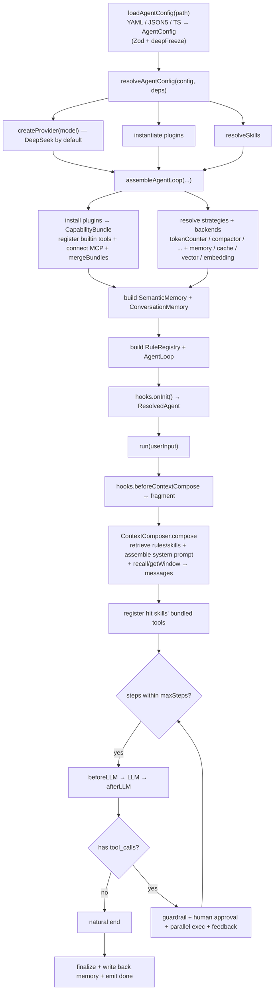

# @agent-engine/core

Agent kernel execution engine: the LLM Provider abstraction, Tool registry, single-agent ReAct loop, hooks / rules / guardrails, pluggable memory / retrieval / embedding backends, MCP client, execution sandbox and event bus.

> **Design rule**: every capability is an **interface + in-memory default + injection point** (`PluginContext.register*` + `CapabilityBundle` + `ResolvedAgent`). Concrete backends (pgvector / redis / embedding models / caches) are supplied by users or the ecosystem.

## Install

```bash
pnpm add @agent-engine/core
```

## Usage

```ts
import { resolveAgentConfig } from '@agent-engine/core';

const resolved = await resolveAgentConfig(config, {
  // plugin factories + provider factory are injected by cli/server
});

const result = await resolved.agent.run('帮我部署到生产');
await resolved.dispose();
```

## Subpath exports

| Subpath                 | Module     | Contents                                                                                                                                                   |
| ----------------------- | ---------- | ---------------------------------------------------------------------------------------------------------------------------------------------------------- |
| `@agent-engine/core`    | —          | `AgentLoop`, `assembleAgentLoop`, `resolveAgentConfig`, `RuleRegistry`, `EventBus`, all backends and types                                                 |
| `.../llm`               | LLM        | `ProviderFactory`, `createProvider`, `createOpenAIProvider`, `createAnthropicProvider`, normalized message/result types, `FinishReason`, `CompletionError` |
| `.../tools`             | Tools      | `Tool`, `ToolRegistry`, builtin primitives (`todo` / `datetime` / `web_search` / `web_fetch`), `createBashTool` / `createFileTool`s                        |
| `.../agent`             | Agent      | `AgentLoop`, `assembleAgentLoop`, run events, `ToolApproval` (Human-in-the-loop), `AgentRunOutcome`                                                        |
| `.../hooks`             | Hooks      | `Hook` interface + `HookPipeline` (10 lifecycle points; observe/rewrite, never block)                                                                      |
| `.../rules`             | Rules      | `RuleRegistry`, `GuardrailRule`, `compileGuardrails` (declarative guardrail axis)                                                                          |
| `.../context`           | Context    | `ContextComposer`, `buildSystemPrompt`, `renderTemplate`, `TokenCounter`, `ContextCompactor`, `SystemPromptInput`                                          |
| `.../documents`         | Documents  | `DocumentNormalizer`, `Chunker`, `TextNormalizer`, `HtmlNormalizer`, `FixedSizeChunker`, `MarkdownHeadingChunker`                                          |
| `.../memory`            | Memory     | `ConversationMemory` (3-tier window), `MemoryBackend`, `Summarizer`, `LongTermMemory`                                                                      |
| `.../retrieval`         | Retrieval  | `CapabilityRegistry` (BM25), `CapabilityLoader`, `Retriever`, `Reranker`, `VectorStore`                                                                    |
| `.../embedding`         | Embedding  | `EmbeddingProvider`, `createEmbeddingProvider` (OpenAI-compatible)                                                                                         |
| `.../mcp`               | MCP        | `connectMcpServer` / `connectMcpServers`, `toTool`, `normalizeCallToolResult`                                                                              |
| `.../plugins`           | Plugins    | `Plugin`, `PluginContext`, `PluginManager`                                                                                                                 |
| `.../capability`        | Capability | `CapabilityBundle`, `mergeBundles`                                                                                                                         |
| `.../capability-source` | Sources    | `resolveSkill` / `resolveSkills`, `resolveMcpServer` / `resolveMcpServers`                                                                                 |
| `.../resolve`           | Resolve    | `resolveAgentConfig` (config → `ResolvedAgent`)                                                                                                            |
| `.../sandbox`           | Sandbox    | `SandboxBackend` (docker/nsjail), `FunctionSandbox` (`WasiFunctionSandbox`)                                                                                |
| `.../events`            | Events     | `EventBus`, `AgentEngineEvent`                                                                                                                             |
| `.../skills`            | Skills     | `Skill`, `loadSkillFromPath`                                                                                                                               |
| `.../structured-output` | Structured | `extractStructured` (JSON mode + Zod validate + retry), `ExtractStructuredInput`                                                                           |
| `.../cache`             | Cache      | `CacheBackend`, `InMemoryCacheBackend`                                                                                                                     |

## Highlights

### Pluggable backends (interface + default + injection)

| Backend              | Interface                | Default                              | Injected via                                        |
| -------------------- | ------------------------ | ------------------------------------ | --------------------------------------------------- |
| Long-term memory     | `MemoryBackend`          | `InMemoryMemoryBackend`              | `registerMemoryBackend` + `memory.longTerm.backend` |
| Cache                | `CacheBackend`           | `InMemoryCacheBackend`               | `registerCacheBackend` + `cache.backend`            |
| Vector store         | `VectorStore`            | `InMemoryVectorStore`                | `registerVectorStore`                               |
| Embedding            | `EmbeddingProvider`      | (no default — real model)            | `registerEmbeddingProvider` / `embedding` config    |
| Token counter        | `TokenCounter`           | `ApproximateTokenCounter`            | `registerTokenCounter`                              |
| Compactor            | `ContextCompactor`       | `TokenBudgetCompactor`               | `registerContextCompactor`                          |
| Retriever / Reranker | `Retriever` / `Reranker` | `Bm25Retriever` / `IdentityReranker` | `registerRetriever` / `registerReranker`            |
| Summarizer           | `Summarizer`             | `LLMSummarizer`                      | `registerSummarizer`                                |

### Three-tier memory

1. **Correct truncation** — token-budget compaction by whole turns (`maxTokens` + `ContextCompactor`).
2. **Compression** — rolling summary of evicted turns (`summary` + `Summarizer`).
3. **Semantic recall** — embedding + vector store + durable storage (`SemanticMemory`, no-ops without an embedding provider).

### Guardrails

Declarative `guardrails` config compiles into executable `GuardrailRule`s (deny/allow tools + deny patterns) via `compileGuardrails`; plugins can also `registerGuardrail`.

### Context assembly (ContextComposer)

`ContextComposer` (`.../context`) owns the "loading / assembly" side of context: it retrieves rules/skills (BM25), assembles the system prompt (template render + rules/skills injection + injected fragments + `[长期记忆]` recall), then appends the session window and emits the final `messages`. `AgentLoop` stays a pure ReAct loop — skill tool registration is delegated back via `compose(...).skillHits`. The `beforeContextCompose` hook is the anchor for injecting external fragments (e.g. `claude.md` / project summaries) before assembly.

## Execution flow



## Design notes

- **Self-built kernel + SDK reuse**: loop / plugins / hooks / rules / guardrails are self-built; LLM / MCP / vectors reuse official SDKs. No LangChain.
- **Multi-model boundary**: `LLMProvider` only covers chat; embedding is a separate `EmbeddingProvider`. Default `model` = chat; `embedding` = vectorization (capability split); subagent models override per-subagent (role axis).
- **hooks vs guardrails**: hooks observe/rewrite, guardrails block.

## Dependencies

- `@agent-engine/config` (schema types)
- `openai` / `@anthropic-ai/sdk` (LLM SDKs)
- `@modelcontextprotocol/sdk` (MCP)
- `minisearch` (BM25), `picomatch`, `zod`, `linkedom` + `@mozilla/readability` (web fetch)

## Status

✅ Implemented (M1–M3 core; multi-agent orchestration is deferred to a separate package).
