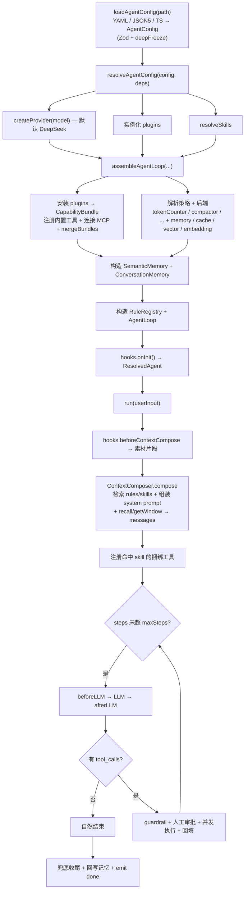

# @agent-engine/core

Agent 内核执行引擎：承载 LLM Provider 抽象、Tool 注册表、单 Agent ReAct 循环、hooks / rules / guardrails、可插拔的记忆 / 检索 / embedding 后端、MCP client、执行沙箱与事件总线。

> **设计铁律**：每个能力都是「**接口 + in-memory 默认 + 注入点**」（`PluginContext.register*` + `CapabilityBundle` + `ResolvedAgent`）。具体后端（pgvector / redis / embedding 模型 / 缓存）由用户或生态接入。

## 安装

```bash
pnpm add @agent-engine/core
```

## 用法

```ts
import { resolveAgentConfig } from '@agent-engine/core';

const resolved = await resolveAgentConfig(config, {
  // plugin 工厂与 provider 工厂由 cli/server 注入
});

const result = await resolved.agent.run('帮我部署到生产');
await resolved.dispose();
```

## 子路径导出

| 子路径                  | 模块       | 内容                                                                                                                                           |
| ----------------------- | ---------- | ---------------------------------------------------------------------------------------------------------------------------------------------- |
| `@agent-engine/core`    | —          | `AgentLoop`、`assembleAgentLoop`、`resolveAgentConfig`、`RuleRegistry`、`EventBus`、各后端与类型                                               |
| `.../llm`               | LLM        | `ProviderFactory`、`createProvider`、`createOpenAIProvider`、`createAnthropicProvider`、归一化消息/结果类型、`FinishReason`、`CompletionError` |
| `.../tools`             | Tools      | `Tool`、`ToolRegistry`、内置原语（`todo` / `datetime` / `web_search` / `web_fetch`）、`createBashTool` / `createFileTool`s                     |
| `.../agent`             | Agent      | `AgentLoop`、`assembleAgentLoop`、运行时事件、`ToolApproval`（Human-in-the-loop）、`AgentRunOutcome`                                           |
| `.../hooks`             | Hooks      | `Hook` 接口 + `HookPipeline`（10 个生命周期点；只观察/改写，不阻断）                                                                           |
| `.../rules`             | Rules      | `RuleRegistry`、`GuardrailRule`、`compileGuardrails`（声明式 guardrail 配置轴）                                                                |
| `.../context`           | Context    | `ContextComposer`、`buildSystemPrompt`、`renderTemplate`、`TokenCounter`、`ContextCompactor`、`SystemPromptInput`                              |
| `.../documents`         | Documents  | `DocumentNormalizer`、`Chunker`、`TextNormalizer`、`HtmlNormalizer`、`FixedSizeChunker`、`MarkdownHeadingChunker`                              |
| `.../memory`            | Memory     | `ConversationMemory`（三层窗口）、`MemoryBackend`、`Summarizer`、`LongTermMemory`                                                              |
| `.../retrieval`         | Retrieval  | `CapabilityRegistry`（BM25）、`CapabilityLoader`、`Retriever`、`Reranker`、`VectorStore`                                                       |
| `.../embedding`         | Embedding  | `EmbeddingProvider`、`createEmbeddingProvider`（OpenAI 兼容）                                                                                  |
| `.../mcp`               | MCP        | `connectMcpServer` / `connectMcpServers`、`toTool`、`normalizeCallToolResult`                                                                  |
| `.../plugins`           | Plugins    | `Plugin`、`PluginContext`、`PluginManager`                                                                                                     |
| `.../capability`        | Capability | `CapabilityBundle`、`mergeBundles`                                                                                                             |
| `.../capability-source` | Sources    | `resolveSkill` / `resolveSkills`、`resolveMcpServer` / `resolveMcpServers`                                                                     |
| `.../resolve`           | Resolve    | `resolveAgentConfig`（配置 → `ResolvedAgent`）                                                                                                 |
| `.../sandbox`           | Sandbox    | `SandboxBackend`（docker/nsjail）、`FunctionSandbox`（`WasiFunctionSandbox`）                                                                  |
| `.../events`            | Events     | `EventBus`、`AgentEngineEvent`                                                                                                                 |
| `.../skills`            | Skills     | `Skill`、`loadSkillFromPath`                                                                                                                   |
| `.../structured-output` | Structured | `extractStructured`（JSON 模式 + Zod 校验 + 重试）、`ExtractStructuredInput`                                                                   |
| `.../cache`             | Cache      | `CacheBackend`、`InMemoryCacheBackend`                                                                                                         |

## 亮点

### 可插拔后端（接口 + 默认 + 注入）

| 后端        | 接口                     | 默认                                 | 注入方式                                            |
| ----------- | ------------------------ | ------------------------------------ | --------------------------------------------------- |
| 长期记忆    | `MemoryBackend`          | `InMemoryMemoryBackend`              | `registerMemoryBackend` + `memory.longTerm.backend` |
| 缓存        | `CacheBackend`           | `InMemoryCacheBackend`               | `registerCacheBackend` + `cache.backend`            |
| 向量库      | `VectorStore`            | `InMemoryVectorStore`                | `registerVectorStore`                               |
| Embedding   | `EmbeddingProvider`      | （无默认——需真实模型）               | `registerEmbeddingProvider` / `embedding` 配置      |
| Token 计数  | `TokenCounter`           | `ApproximateTokenCounter`            | `registerTokenCounter`                              |
| 裁剪器      | `ContextCompactor`       | `TokenBudgetCompactor`               | `registerContextCompactor`                          |
| 检索 / 重排 | `Retriever` / `Reranker` | `Bm25Retriever` / `IdentityReranker` | `registerRetriever` / `registerReranker`            |
| 摘要器      | `Summarizer`             | `LLMSummarizer`                      | `registerSummarizer`                                |

### 三层记忆

1. **正确截取** —— token 预算按整轮淘汰（`maxTokens` + `ContextCompactor`）。
2. **压缩层** —— 淘汰轮滚动摘要（`summary` + `Summarizer`）。
3. **语义层** —— embedding 向量化 + 向量召回 + 持久化（`SemanticMemory`，无 embedding 时优雅 no-op）。

### Guardrail

声明式 `guardrails` 配置经 `compileGuardrails` 编译为可执行的 `GuardrailRule`（工具白/黑名单 + 入参/结果正则）；插件也可 `registerGuardrail`。

### 上下文组装（ContextComposer）

`ContextComposer`（`.../context`）负责「装载」侧：检索 rules/skills（BM25）→ 组装 system prompt（模板渲染 + rules/skills 注入 + 注入片段 + `[长期记忆]` 召回）→ 追加会话窗口 → 产出最终 `messages`。`AgentLoop` 只做 ReAct 循环——命中 skill 的捆绑工具经 `compose(...).skillHits` 交回注册。`beforeContextCompose` 钩子用于在组装前注入外部素材（如 `claude.md` / 项目摘要）。

## 执行流程



## 设计要点

- **内核自研 + SDK 复用**：循环 / 插件 / hooks / rules / guardrails 自研；LLM / MCP / 向量复用官方 SDK。不引入 LangChain。
- **多模型边界**：`LLMProvider` 只覆盖 chat；embedding 是另一个抽象 `EmbeddingProvider`。默认 `model` = chat，`embedding` = 向量化（能力维度分离）；subagent 模型在 subagent 定义里覆盖（角色维度实例级）。
- **hooks 与 guardrail 分工**：hooks 观察/改写，guardrail 阻断。

## 依赖

- `@agent-engine/config`（Schema 类型）
- `openai` / `@anthropic-ai/sdk`（LLM SDK）
- `@modelcontextprotocol/sdk`（MCP）
- `minisearch`（BM25）、`picomatch`、`zod`、`linkedom` + `@mozilla/readability`（web fetch）

## 状态

✅ 已实现（M1–M3 内核；多 Agent 编排延后到独立包）。
